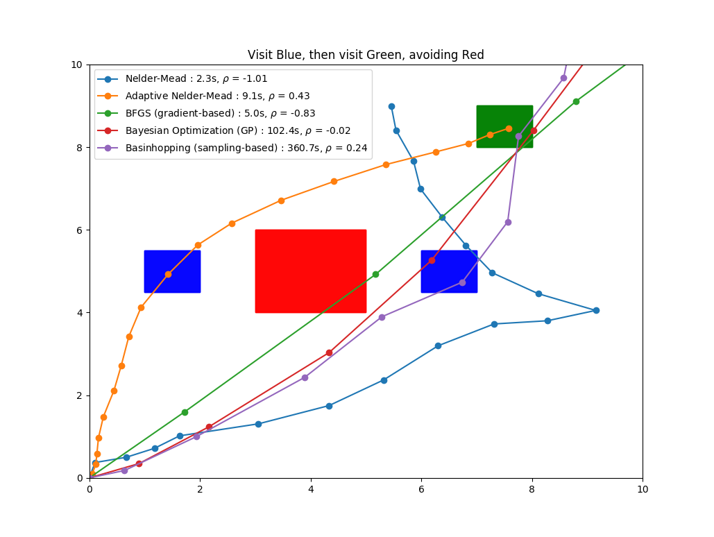

# STL_optimization
Comparison of optimization methods for controller synthesis from STL specifications

## Dependencies

- python3
- numpy
- [scikit-optimize](https://scikit-optimize.github.io/)
- [pySTL](https://github.com/vincekurtz/pySTL)

## Usage

See `reach_avoid_example.py` for a simple example of usage. 

Scenarios (including robot dynamics, STL specification, etc) should be defined 
following the templates in `example_scenarios.py`. The `cost_function` method 
ultimately defines the cost function which we will optimize over. This is a function
from control inputs to the robustness degree: any number of black-box optimization
algorithms can be applied to this function.

`optimization_comparison.py` compares several optimization algorithms on one of
the examples in `example_scenarios.py`. It can be used to generate plots like the one shown below:

Further information on the optimization algorithms used:

- [Nelder-Mead Algorithm](https://en.wikipedia.org/wiki/Nelder%E2%80%93Mead_method)
- [Adaptive Nelder-Mead](https://link.springer.com/article/10.1007/s10589-010-9329-3)
- [BFGS](https://en.wikipedia.org/wiki/Broyden%E2%80%93Fletcher%E2%80%93Goldfarb%E2%80%93Shanno_algorithm)
- [Bayesian Optimization](https://arxiv.org/pdf/1807.02811.pdf)
- [Basinhopping](https://pubs.acs.org/doi/10.1021/jp970984n)
